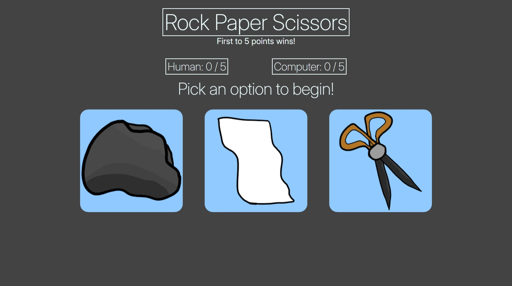
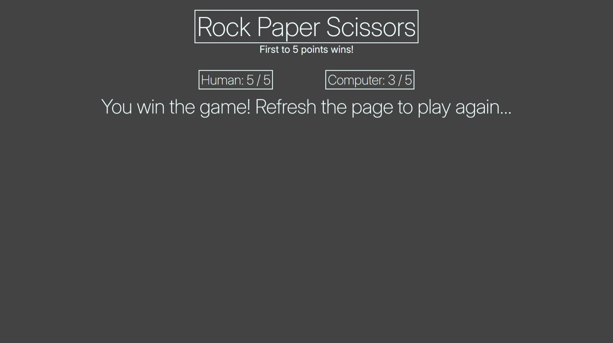
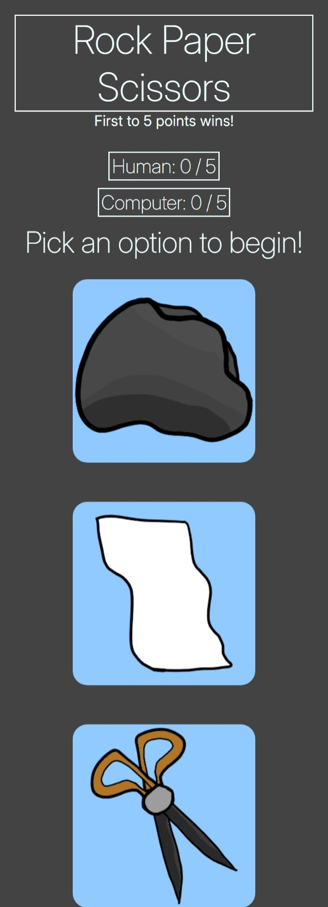

# rock-paper-scissors
Rock paper scissors project based on The Odin Project curriculum. (UI was added after progressing further through the curriculum.)

Live demo link: https://j0e-quan.github.io/rock-paper-scissors/

## Technologies used:
 - HTML for basic layout of elements
 - CSS for styling UI and using web fonts (Inter)
 - Flexbox used to organise layout (wraps to fit mobile displays)
 - JavaScript for game logic
 - Git for version control

## Key features:
 - Touch-friendly buttons utilizing event listeners
 - Real-time score tracking and displaying of results
 - Winner determined upon reaching 5 points

## Credits:
 - Button icons were drawn by me using Adobe Fresco

## Gallery:

